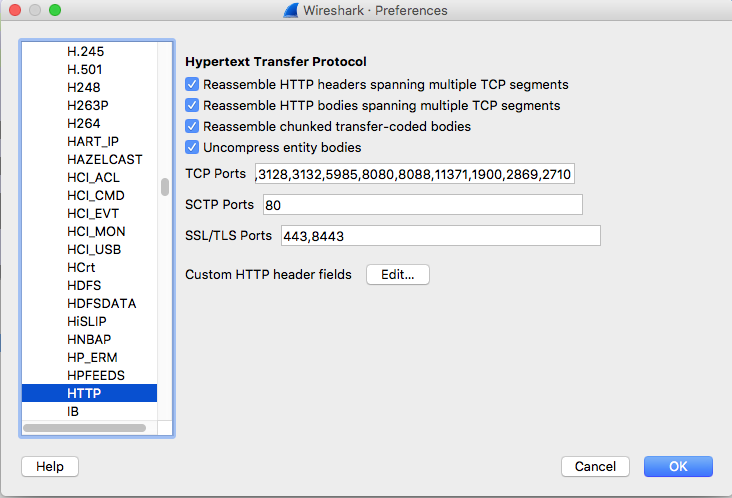

# Tomahawk
Java agent that allows wireshark to decrypt TLS traffic that uses DH cipher suites

## Usage
Add the tomahawk agent to your JVM by adding the following to your `setenv.sh`:

```
export JAVA_OPTS="$JAVA_OPTS -javaagent:/PATH/TO/tomahawk-1.0.0-shaded.jar"
```

## Configuration

By default, the log file will be written to `~/ssl.log`. You can customize this by adding a system property `-DTomahawkAgent.logfile=/path/to/ssl.log` 

## Running

### Example STDOUT

Look for the following log entries. The last two log entries will appear upon the first TLS request to the JVM:

```
Fri Oct 20 11:13:46 CDT 2017 TomahawkAgent: TomahawkAgent installed. Will attempt to log TLS secrets
Fri Oct 20 11:14:09 CDT 2017 TomahawkAgent: Attempting to enhance 'sun.security.ssl.Handshaker'...
Fri Oct 20 11:14:09 CDT 2017 TomahawkAgent: '-DTomahawkAgent.logfile=...' property not defined, using '/Users/jonathanfisher/ssl.log' instead
```

### Example log file

```
# Generated by TomahawkAgent Fri Oct 20 11:19:35 CDT 2017
# Fri Oct 20 11:19:35 CDT 2017
CLIENT_RANDOM a5bb83bfa8dda2cb9736e722c8398151424330b81700d3b30abc3fb449638a94 7993af17698b158c71ad765ff38bb9554d963c6ebcda058be9a90694cfa31d7d54c56ec590f3ab4fe732d9cfd99ac3ba
```

## Analyzing with Wireshark

### Setup
In Wireshark preferences, make sure your TLS ports include 8443, if you're capturing local traffic:



Next tell Wireshark where your file is:


